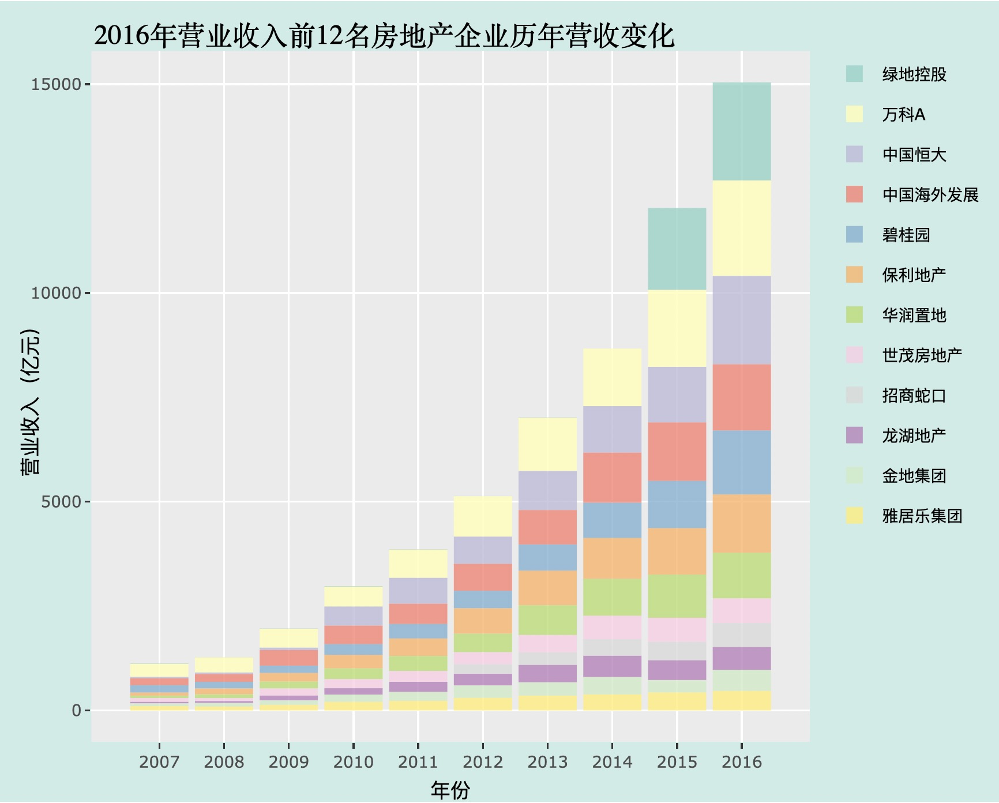

### 1. Making Fancy Business Data Visualizations within five lines of R code(1): Bar Plots For Market Share Change

**Description:** It's common to ask what are the top 10 companies in a certain industry at a certain year and how are their relative position changing over time. This blog shows how we can achieve this task using within five lines of R code from loading original data. 

**Link:** [Bar Plots For Market Share Change](https://jkang37.github.io/Data-Processing-and-Plotting/Blogs/blog1.html)

**View:**

